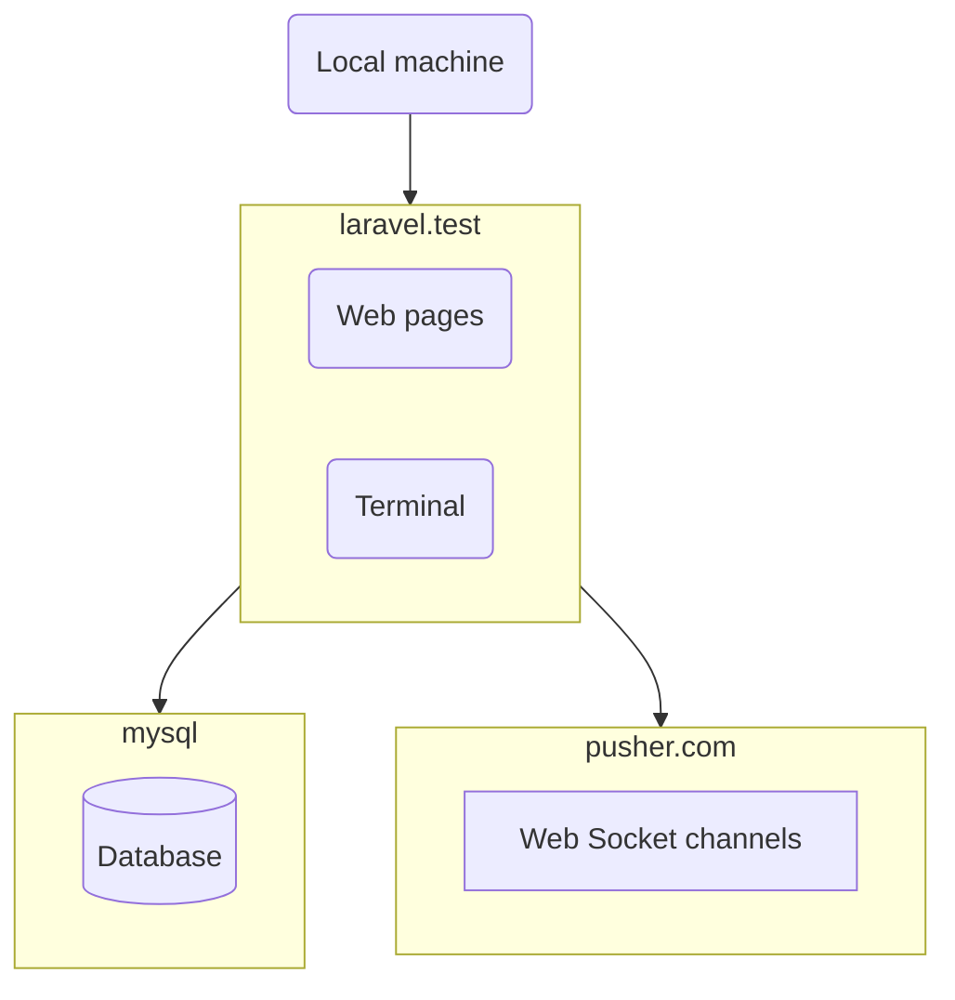

# `bronze-raven`

* [Introduction](#introduction)
* [Docker installation](#docker-installation)
    * [Containers and external services](#containers-and-external-services)
    * [Prerequisites](#prerequisites)
    * [Installation](#installation)
* [Usage](#usage)
* [Database schema](#database-schema)
    * [`pages`](#pages) 
    * [`slugs`](#slugs) 
    * [`accounts`](#accounts) 
    * [`users`](#users) 
    * [`organizations`](#organizations) 
    * [`organization_user`](#organizationuser) 
* [How it works](#how-it-works)
    * [Dynamic routes](#dynamic-routes)
    * [`Page` page component](#page-page-component) 
    * [`Editable` component](#editable-component) 
    * [`EditableMarkdown` component](#editablemarkdown-component) 
    * [Synchronization across multiple users](#synchronization-across-multiple-users) 

## Introduction

This is a Laravel + Vue.js + Inertia.js project implementing: 

* **dynamic route dispatch** configured in the database;
* **inline website content editing** directly on the frontend page, reducing the need of an admin panel;
* **near real-time synchronization across multiple users** eliminating the need to refresh a page to receive a fresh version of it.

## Docker installation

### Containers and external services



As you can see in the `docker-compose.yml`, it uses 2 containers:

* `laravel.test` container runs PHP code - Web pages and CLI commands.
* `mysql` container stores the database.

In addition, the application broadcasts model changes to open browser tabs through [Pusher](https://pusher.com/).
 
### Prerequisites

Before installing the project:

* Install
    * PHP 8.1
    * Composer
    * Node.js
    * Docker 2
    * Docker Compose
* [Create the `sail` shell alias](https://laravel.com/docs/9.x/sail#configuring-a-shell-alias).
* Create a [Pusher](https://pusher.com/) account, and an app in it named `bronze-raven`.

### Installation

Install the project into the `~/projects/bronze-raven` directory (the "project directory"):

1. Download and prepare the project files using the following commands:

        cd ~/projects
        git clone git@github.com:osmianski/bronze-raven.git
        cd bronze-raven
        composer install
        npm install
        php -r "file_exists('.env') || copy('.env.example', '.env');"
        php artisan key:generate --ansi

2. Fill in Pusher credentials in the `.env` file:

        PUSHER_APP_ID=
        PUSHER_APP_KEY=
        PUSHER_APP_SECRET=
        PUSHER_APP_CLUSTER=
 
3. In a separate terminal window, start the Docker containers by running the following commands, and keeping it running there:

        cd ~/projects/bronze-raven
        sail up

4. In a separate terminal window, start Vite by running the following commands, and keeping it running there:

        cd ~/projects/bronze-raven
        npm run dev

5. Prepare the database and sample data:

        cd ~/projects/bronze-raven
        sail artisan migrate:fresh --seed

## Usage 

At the first sight, this website is just nothing fancy. But the first impression is misleading.

The thing is, you can edit the web pages right here in the browser.

For example, to edit the title of a page, click on it - and it becomes editable, change the text to your liking,  press `Enter` - and voilà - it's changed, forever!

Yes, it's that simple. In fact, it's even simpler - you even need the `Enter` - just click outside the title, and your changes are still applied.

There is more. To cancel editing, press `Escape`. To confirm the changes and edit the page content, press `Tab`.

Content editing works just the same, just use `Ctrl + Enter` to confirm the changes.

There is even more. If someone else edits the same page, their changes are shown to you in an instant!

## Database schema

To understand the application, first get acquainted with its database schema. 

### `pages`

Both the home page and the "Usage" page are instances of the [`Page`](https://github.com/osmianski/bronze-raven/blob/v0.1/app/Models/Page.php) Eloquent model. 

They are seeded during installation by running the `sail artisan migrate:fresh --seed` command. 

At the moment, there is no UI for creating other pages, but when it's implemented, these pages will be stored, rendered and edited in exactly the same way. 

Important columns:

* `title` - the page title.
* `body` - the page body written in Markdown.
* `owner_id` - the [account](#accounts) that owns this page. 

Pages are stored in the `pages` database table.

### `slugs`

Dynamic URLs are listed in the `slugs` table and managed using the [`Slug`](https://github.com/osmianski/bronze-raven/blob/v0.1/app/Models/Slug.php) Eloquent model.

Important columns:

* `slug` - URL path without the `.html` suffix, or an empty string in the case of the home page.
* `type` - the type of the page under the slug. At the moment, the only slug type `Type::Page`, and it renders `Page` models. In the future, slug types rendering e-commerce products or blog posts may be implemented.
* `page_id` - the [page](#pages) to be rendered if the `type` is `Type::Page`, or `null` otherwise.

### `accounts`

At the moment, any guest user can edit any data they can access. Eventually, user actions will be restricted according to data ownership, and the database schema already lays down a solid foundation for that.

The concept of account is at the core of it. Simply put, an account is somebody that owns certain database records, can edit or access them.

Accounts are stored in the `accounts` database table and managed using the [`Account`](https://github.com/osmianski/bronze-raven/blob/v0.1/app/Models/Account.php) Eloquent model. 

There are two types of accounts: users and organizations. 

Account records are created automatically in the [`OrganizationObserver`](https://github.com/osmianski/bronze-raven/blob/v0.1/app/Observers/OrganizationObserver.php) and [`UserObserver`](https://github.com/osmianski/bronze-raven/blob/v0.1/app/Observers/UserObserver.php).

Important columns:

* `type` - the type of the account, either `Type::User` or `Type::Organization`.
* `organization_id` - the underlying [organization](#organizations), if the `type` is `Type::Organization`, or `null` otherwise.
* `user_id` - the underlying [user](#users), if the `type` is `Type::User`, or `null` otherwise.

### `users`

It's a standard Laravel table for the registered application users managed using the [`User`](https://github.com/osmianski/bronze-raven/blob/v0.1/app/Models/User.php) Eloquent model.

Initial user is seeded during installation by running the `sail artisan migrate:fresh --seed` command. Its email is `admin@osmianski.com`, the password is `secret`, and it belongs to the `Administrators` organization.

### `organizations`

Simply put, an organization is a group of users.

Organizations are stored in the `organizations` database table and managed using the [`Organization`](https://github.com/osmianski/bronze-raven/blob/v0.1/app/Models/Organization.php) Eloquent model.

Initial organization, `Administrators` is seeded during installation by running the `sail artisan migrate:fresh --seed` command. It's the only organization having the `is_admin` flag set that allows its users to do anything in the application.

### `organization_user`

[Organizations](#organizations) and [users](#users) are in many-to-many relationship, and the `organization_user` table is a pivot table for this relationship. 

## How it works

### Dynamic routes

In addition to traditional Laravel routes that handle pre-defined URLs, there are two [application routes](https://github.com/osmianski/bronze-raven/blob/v0.1/routes/web.php) that handle dynamic URLs:

```php
Route::get('/', [SlugController::class, 'home']);
Route::get('{slug:slug}.html', [SlugController::class, 'show'])
    ->where('slug', '([A-Za-z0-9\-\/]+)');
```

The [`SlugController`](https://github.com/osmianski/bronze-raven/blob/v0.1/app/Http/Controllers/SlugController.php) instantiates the controller responsible for the slug type, and executes its `show()` method.

At the moment, there is only one slug type, and one controller handling it. The mapping is defined in the [`Slug\Type::getControllerClass()`](https://github.com/osmianski/bronze-raven/blob/v0.1/app/Models/Slug/Type.php) method:

```php
public function getControllerClass(): string {
    return match ($this) {
        self::Page => PageController::class,
        default => throw new NotImplemented(),
    };
}
```

All these controllers must implement the [`Sluggable`](https://github.com/osmianski/bronze-raven/blob/v0.1/app/Http/Controllers/Sluggable.php) interface:

```php
interface Sluggable
{
    /**
     * Renders an Inertia page for the specified slug.
     * 
     * @param Slug $slug
     * @return Response|ResponseFactory
     */
    public function show(Slug $slug): Response|ResponseFactory;
}
```

### `Page` page component

The [`PageController`](https://github.com/osmianski/bronze-raven/blob/v0.1/app/Http/Controllers/PageController.php) renders the [`Page`](https://github.com/osmianski/bronze-raven/blob/v0.1/resources/js/Pages/Page.vue) page component.

It uses [`Editable`](#editable-component) and [`EditableMarkdown`](#editablemarkdown-component) to allow the user to change page title and body, accordingly.

And when either of them change, it sends the changes to the server:

```javascript
editablePageProps.forEach(property => {
    watch(() => props.page[property], value =>
        updatePageProperty(property, value, { id: props.page.id}));
});

function updatePageProperty(property, value, filter) {
    const request = {
        method: 'post',
        baseURL: usePage().props.baseUrl,
        url: '/pages',
        params: filter,
        data: {},
    };
    request.data[property] = value;
    axios(request).catch(function (error) {
        console.log(error);
    });
}
```

On the server, the [`PageController::update()`](https://github.com/osmianski/bronze-raven/blob/v0.1/app/Http/Controllers/PageController.php) method saves the changes in the database.

### `Editable` component

The [`Editable`](https://github.com/osmianski/bronze-raven/blob/v0.1/resources/js/Components/Editable.vue) component makes the bound content `contenteditable` on focus, it applies the changes on blur (or `Enter`), or it cancels the changes on `Escape`.

Usage:

```javascript
import Editable from "@/Components/Editable.vue";
...
<Editable v-model="page.title" element="h1" class="..." />
```
    
### `EditableMarkdown` component

The [`EditableMarkdown`](https://github.com/osmianski/bronze-raven/blob/v0.1/resources/js/Components/EditableMarkdown.vue) component makes the bound Markdown content editable on focus, it applies the changes on blur (or `Ctrl+Enter`), or it cancels the changes on `Escape`.

Usage:

```javascript
import EditableMarkdown from "@/Components/EditableMarkdown.vue";
...
<EditableMarkdown v-model="page.body" />
```
### Synchronization across multiple users

Whenever a [`Page`](https://github.com/osmianski/bronze-raven/blob/v0.1/app/Models/Page.php) is updated in the database, it's configured to broadcast the `.PageUpdated` event (the dot is important!):

```php
class Page extends Model
{
    use ..., BroadcastsEvents;
    ...
    public function broadcastOn(string $event): array
    {
        return [
            new Channel('pages'),
        ];
    }
    ...
}
```

What happens then:

1. It puts the broadcasted event on the queue. 
2. As it uses the `QUEUE_CONNECTION=sync` driver in the `.env` file, no actual queue is used, and it's broadcasted immediately.
3. As it uses the `BROADCAST_DRIVER=pusher` driver in the `.env` file, the broadcasted event is sent to Pusher.

Meanwhile, as defined in the [`bootstrap.js`](https://github.com/osmianski/bronze-raven/blob/v0.1/resources/js/bootstrap.js) file, each browser opens a WebSockets connection to Pusher when the page loads: 

```javascript
import Echo from 'laravel-echo';
import Pusher from 'pusher-js';

window.Pusher = Pusher;

window.Echo = new Echo({
    broadcaster: 'pusher',
    key: import.meta.env.VITE_PUSHER_APP_KEY,
    cluster: import.meta.env.VITE_PUSHER_APP_CLUSTER,
    forceTLS: true
});
```

The [`Page` page component](#page-page-component) listens for the `.PageUpdated` event, and updates the rendered page model:

```javascript
Echo.channel(`pages`).listen('.PageUpdated', (e) => {
    if (e.model.id === props.page.id) {
        Object.assign(props.page, e.model);
    }
});
```
