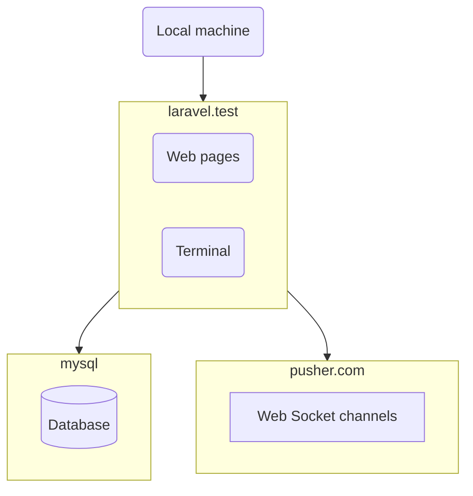

# `bronze-raven`

* [Introduction](#introduction)
* [Docker installation](#docker-installation)
    * [Containers and external services](#containers-and-external-services)
    * [Prerequisites](#prerequisites)
    * [Installation](#installation)
* [How it works](#how-it-works)

## Introduction

This is a Laravel + Vue.js + Inertia.js project implementing inline website content editing (directly on the frontend page, reducing the need of an admin panel) and synchronization across multiple users (eliminating the need to refresh a page to receive a fresh version of it).

## Docker installation

### Containers and external services



As you can see in the `docker-compose.yml`, it uses 2 containers:

* `laravel.test` container runs PHP code - Web pages and CLI commands.
* `mysql` container stores the database.

In addition, the application broadcasts model changes to open browser tabs through [Pusher](https://pusher.com/).
 
### Prerequisites

Before installing the project:

* Install
    * PHP 8.1
    * Composer
    * Node.js
    * Docker 2
    * Docker Compose
* [Create the `sail` shell alias](https://laravel.com/docs/9.x/sail#configuring-a-shell-alias).
* Create a [Pusher](https://pusher.com/) account, and an app in it named `bronze-raven`.

### Installation

Install the project into the `~/projects/bronze-raven` directory (the "project directory"):

1. Download and prepare the project files using the following commands:

        cd ~/projects
        git clone git@github.com:osmianski/bronze-raven.git
        cd bronze-raven
        composer install
        npm install
        php -r "file_exists('.env') || copy('.env.example', '.env');"
        php artisan key:generate --ansi

2. Fill in Pusher credentials in the `.env` file:

        PUSHER_APP_ID=
        PUSHER_APP_KEY=
        PUSHER_APP_SECRET=
        PUSHER_APP_CLUSTER=
 
3. In a separate terminal window, start the Docker containers by running the following commands, and keeping it running there:

        cd ~/projects/bronze-raven
        sail up

4. In a separate terminal window, start Vite by running the following commands, and keeping it running there:

        cd ~/projects/bronze-raven
        npm run dev

5. Prepare the database and sample data:

        cd ~/projects/bronze-raven
        sail artisan migrate:fresh --seed

## Usage 

At the first sight, this website is just nothing fancy. But the first impression is misleading.

The thing is, you can edit the web pages right here in the browser.

For example, to edit the title of a page, click on it - and it becomes editable, change the text to your liking,  press `Enter` - and voilà - it's changed, forever!

Yes, it's that simple. In fact, it's even simpler - you even need the `Enter` - just click outside the title, and your changes are still applied.

There is more. To cancel editing, press `Escape`. To confirm the changes and edit the page content, press `Tab`.

Content editing works just the same, just use `Ctrl + Enter` to confirm the changes.

There is even more. If someone else edits the same page, their changes are shown to you in an instant!

## Models

To understand the application, first get acquainted with its data structures. 

### `Page`

Both the home page and the "Usage" page are instances of the [`Page`](https://github.com/osmianski/bronze-raven/blob/v0.1/app/Models/Page.php) Eloquent model. They are seeded during installation by running the `sail artisan migrate:fresh --seed` command. At the moment, there is no UI for creating other pages, but when it's implemented, these pages will be stored, rendered and edited in exactly the same way. 

Important properties:

* `title` - the page title
* `body` - the page body written in Markdown
* `owner_id` - the [account](#account) that owns this page 

Pages are stored in the `pages` database table.

### `Slug`

In addition to traditional Laravel routes that handle pre-defined URLs, there are two [application routes](https://github.com/osmianski/bronze-raven/blob/v0.1/routes/web.php) that handle dynamic URLs:

```php
Route::get('/', [SlugController::class, 'home']);
Route::get('{slug:slug}.html', [SlugController::class, 'show'])
    ->where('slug', '([A-Za-z0-9\-\/]+)');
```

Dynamic URLs are listed in the `slugs` table and managed by the [`Slug`](https://github.com/osmianski/bronze-raven/blob/v0.1/app/Models/Slug.php) Eloquent model.

Important properties:

* `slug` - the recognized path of the URL path, or an empty string in the case of the home page.
* `type` - the type of the page under the slug.
* `page_id` - the [page](#page) to be rendered if the `type` is `Type::Page`, or `null` otherwise

At the moment, the only slug type `Type::Page`, and it renders `Page` models. In the future, slug types rendering e-commerce products or blog posts may be implemented. 

### `Account`

At the moment, any guest user can edit any data they can access. Eventually, user actions will be restricted according to data ownership.


## How it works

### `Sluggable`

All these controllers must implement the [`Sluggable`](https://github.com/osmianski/bronze-raven/blob/v0.1/app/Http/Controllers/Sluggable.php) interface:

```php
interface Sluggable
{
    /**
     * Renders the Inertia response for the specified slug.
     * 
     * @param Slug $slug
     * @return Response|ResponseFactory
     */
    public function show(Slug $slug): Response|ResponseFactory;
}
```

### `Editable` Vue component

### `EditableMarkdown` Vue component
